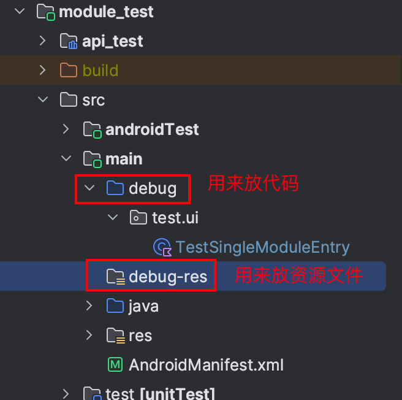

**目录**

- [模块分类](#模块分类)
  - [lib](#lib)
  - [module](#module)
  - [api](#api)
- [新建模块](#新建模块)
  - [新建lib模块](#新建lib模块)
  - [新建module模块](#新建module模块)
  - [新建api模块](#新建api模块)
  - [使用Phone&Tablet新建模块](#使用Phone&Tablet新建模块)
- [模块间通信](#模块间通信)
  - [启动另一个模块的Activity](#启动另一个模块的Activity)
  - [启动另一个模块的Fragment](#启动另一个模块的Fragment)
  - [与另一个模块进行交互](#与另一个模块进行交互)
- [单模块调试](#单模块调试)
  - [会遇到的问题](#会遇到的问题)
    - [Gradle编译报错](#Gradle编译报错)
- [删除模块](#删除模块)
- [模块缓存](#模块缓存)
- [多模块的坑](#多模块的坑)
  - [XML预览主题问题](#XML预览主题问题)
  - [分支切换](#分支切换)


# 使用多模块的第 0 步
## 解决 gradle 中文乱码
请在 AS 的 Help - Edit Custom VM Options 中 添加 -Dfile.encoding=UTF-8 然后重启 AS，
不然 gradle 中文乱码，影响多模块开发

## 加快编译速度
设置 AS 堆内存，按需设置，肯定越大越好


## 确保文件编码一致


# 多模块指南

## 模块分类

大致分为三类：lib、module、api

### lib

共用模块，一般不涉及到界面，而是一些功能的封装

比如：`lib_account` 是专门负责用户信息的模块，里面应该存储登录后用户的相关信息，但请注意：登录界面不应该写在这个里面，应该写在 `module` 模块里面


### module

业务模块，一般与某个业务相关联，包含界面

比如：`module_store` 是专门负责商店的模块，与商店相关的界面都应该写在这个里面


### api

接口模块，一般用于多个模块间的通信

由于多模块中会出现需要互相传递信息的情况，而为了不让他们之间互相依赖，所以采用构建 `api` 模块来定义接口而间接实现通信


## 新建模块

<details>
<summary>模块类型</summary>

1. **项目**右键选择 `Module`


2. 选择模块模板，这里有多个选项

   

   其中只需要前两个（`Phone & Tablet` 和 `Android Library`）就可以了，这里讲一下他们的区别

   - Phone & Tablet

     >主要用于新建 `module` 类型的模块 (但是我并不推荐使用它新建 module 模块，原因请看后文)
     >
     >建好的模块会在 `build.gradle` 中默认添加 `com.android.application` 插件

   - Android Library

     >主要用于新建 `lib`、`api` 类型的模块
     >
     >建好的模块会在 `build.gradle` 中默认添加 `com.android.library` 插件

3. 下面根据具体的类型分开讲解创建过程

</details>

### 新建lib模块

<details>
<summary>折叠/展开</summary>

1. 选择 `Android Library`，**记得把那个下划线改成点号**

   

   

   > 选择 `Android Library` 比选择 `Phone & Tablet` 可以少改动一些东西，因为该项目需要统一配置模块，如果你不小心点错了，请看：[使用Phone&Tablet新建模块](#使用Phone&Tablet新建模块)
   >
   > 如果你忘记了改下划线为点号，可以手动新建文件夹，然后移动过去（但如果你有强迫者，也可以把 `androidTest` 和 `test` 源集中的包名一起改一下）

2. 修改 `build.gradle`，由于项目中自定义了模块的管理（`build_logic`），所以使用 AS 新建模块需要修改一些东西

   ```kotlin
   plugins {
       id("module-manager") // 该插件整合了所有模板配置
   }
   
   // 如果该模块要使用网络请求，就调用该方法，已默认包含 retrofit、okhttp、gson
   dependNetwork()
   // 如果该模块要使用协程
   dependCoroutines()
   // 主流三方库都已经设置了方法来依赖，输入: dependXXX() idea 会智能提示其他依赖
   
   dependencies {
       // 这里面写只有自己模块才会用到的依赖
   }
   ```

3. 修改根路径下的 `settings.gradle.kts`

   > 每次 AS 新建模块都会自动帮你 include 新模块，但 `build_logic` 会遍历文件夹自动 include 所有模块，所以需要删掉 AS 写的
   >
   > 

4. 删除模块目录下的 `consumer-rules.pro`、`proguard-rules.pro`、`libs`

   

   

5. 注册 lib 模块

   > 为了统一依赖方式，你需要在 `build_logic` 中对该模块进行注册
   >
   > ```kotlin
   > // build_logic/core/versions/src/main/kotlin/project/LibDepend.kt
   > object LibDepend {
   >     const val test = ":lib_test"
   > }
   > 
   > // 注册后再刷新一下 `gradle` （点击右上角的大象图标）
   > // 其他模块中的 build.gradle.kts 中依赖该 lib 模块
   > dependLibTest()
   > ```
   >
   > 

</details>

### 新建module模块

<details>
<summary>折叠/展开</summary>

1. 这里选择 `Android Library`，**记得把那个下划线改成点号**，还有后面写 `Activity` 名字，别只会写 `MainActivity`

   

   

2. 创建好了后需要与[创建 `lib` 模块](#新建lib模块)一样修改一遍，这里不再叙述

   >注意：`module` 需要引入的依赖与 `lib` 不同
   >
   >```kotlin
   > plugins {
   >    id("module-manager")
   > }
   >
   > dependXXX()
   > // 还有其他比如协程、Reteofit、Glide 等，可以去 build_logic 中寻找
   > // 基本上能用到的全都有依赖方式
   >
   > dependencies {
   >   // 这里面写只有自己模块才会用到的额外依赖
   >   // 如果 build_logic 中已有，请直接使用
   >   // 可以通过 Ctrl + Shift + F 搜索项目关键词快速查看是否存在相同依赖
   >
   >   // 注意：如果你使用了第三方库，请添加该库的混淆规则，混淆文件在 build_logic 中
   > }
   >```
   >
   >注意：module 模块已默认依赖 `dependAndroidView()`、`dependAndroidKtx()`、`dependLifecycleKtx()`，需要其他依赖时，请按需选择依赖，而不是依赖全部
   
8. 基本上 `module` 就是这样

   >进阶设置，但建议你第一次按顺序观看：
   >
   >- [单模块调试](#单模块调试)
   >- [模块间通信](#模块间通信)

9. 由于 AS 的原因，每次按照它的模板新建 `Activity` 和 `Fragment`，它都会主动添加 `android` 插件和默认依赖到 `build.gradle.kts` 中，如下：

   

   因为使用的多模块插件，所以目前无解，但不影响正常编译，**建议写完整个模块后删去这些内容**

</details>

### 新建api模块

<details>
<summary>折叠/展开</summary>

`api` 模块用于模块间通信，一般把它建在需要向外提供接口的 `module` 模块下

1. 需要向外提供接口的 `module` 模块下新建模块

   

   

2. 其余过程与[新建 `lib` 模块]($新建lib模块)基本一样

   >与 `lib` 不同之处在于:
   >
   >- 一般 `api` 模块不需要依赖
   >- `api` 模块下一般只有接口和一些简单类，不负责逻辑的实现，逻辑是交给实现类实现的
   >- 可以把 `src` 下的 `androidTest` 和 `test` 文件给删掉，测试文件，`api` 模块一般用不到

3. 注册 `api` 模块

   >为了更好的实现多模块中的单模块调试功能，你需要在 `build_logic` 中对该模块进行注册
   >
   >```kotlin
   >// build_logic/core/versions/src/main/kotlin/project/ApiDepend.kt
   >object ApiDepend {
   >    val test = ":module_test:api_test" by parent
   >}
   >
   >// 注册后再刷新一下 `gradle` （点击右上角的大象图标）
   >// 其他模块中的 build.gradle.kts 中依赖该 api 模块
   >dependApiTest()
   >
   >// 这样写的原因在 ApiDepend 头注释上有说明
   >```
   >
   >

4. `api` 模块新建比较简单，对于它的使用会在后面进行讲解

   > api 模块的使用配置：[与另一个模块进行交互](#与另一个模块进行交互)

</details>

### 使用Phone&Tablet新建模块

<details>
<summary>折叠/展开</summary>

上面是用的 `Android Library` 新建的模块，担心你不小心点成了 `Phone & Tablet`，所以这里提供了这个教程 (如果你没有设置错可以跳过)

1. 前面的教程与 `Android Library` 新建的模块基本保持一致，主要是后面需要删一些东西

2. 删除 `res` 下的这些东西，删除时可能会告诉你有引用持有，不管，直接 `Delete Anyway`

   

   

3. 删除 `strings.xml` 中的 `app_name`

   ```xml
   <!--把这个 app_name 删除掉-->
   <string name="app_name">module_test</string>
   <!--如果不删除的话，最后打包这个会覆盖掉应用的 app_name-->
   ```

4. 修改 `AndroidMainfest.xml` 文件，改成下面这样：

   ```xml
   <application>
       <activity
           android:name=".TestActivity"
           android:exported="true">
       </activity>
   </application>
   ```

   >这是与原来的对比：
   >
   >```xml
   ><application
   >    android:allowBackup="true"
   >    android:icon="@mipmap/ic_launcher"
   >    android:label="@string/app_name"
   >    android:roundIcon="@mipmap/ic_launcher_round"
   >    android:supportsRtl="true"
   >    android:theme="@style/Theme.WanAndroid_Multi">
   >    <activity
   >        android:name=".TestActivity"
   >        android:exported="true">
   >        <intent-filter>
   >            <action android:name="android.intent.action.MAIN" />
   >            <category android:name="android.intent.category.LAUNCHER" />
   >       </intent-filter>
   >    </activity>
   ></application>
   >```
   >
   >删除以下内容：
   >
   >- `application` 的一些设置
   >- `TestActivity` 设置成主启动的设置
   >
   >删掉的原因在于：如果其他模块不删除，那么会覆盖掉应用的设置
   >
   >**所以强烈建议使用`Android Library` 新建模块**

</details>

## 模块间通信

建立多模块是为了将应用细化，但多模块之间会存在互相依赖的情况，所以需要使用路由框架来实现模块间的通信效果

下面将讲解主流的路由框架 `ARouter` 的使用

`ARouter` 仓库地址：https://github.com/alibaba/ARouter/tree/master

`ARouter` 文档：https://github.com/alibaba/ARouter/blob/master/README_CN.md

### 启动另一个模块的Activity

<details>
<summary>折叠/展开</summary>

我在 `module_main` 的 `MainActivity` 启动 `module_test` 中的 `TestActivity`

```kotlin
// TestActivity
@Route(path = TEST_ENTRY) // 加上这个路由地址，其中 TEST_ENTRY 统一写在 lib_config/../route/RouteTable.kt 中
class TestActivity : BaseActivity() {
    override fun onCreate(savedInstanceState: Bundle?) {
        super.onCreate(savedInstanceState)
        setContentView(R.layout.test_activity_test)
    }
}
```

```kotlin
// MainActivity
class MainActivity : BaseActivity() { 
    override fun onCreate(savedInstanceState: Bundle?) { 
        super.onCreate(savedInstanceState)
        setContentView(R.layout.main_activity_main)
        
        // 直接使用 ARouter 跳转即可，但是我不建议这样写，ARouter 仍然需要再次进行一层封装
        ARouter.getInstance()
            .build(TEST_ENTRY)
            .navigation()
        
        // 封装掉 ARouter 的终极写法为：
        ServiceManager.activity(TEST_ENTRY)
    }
}
```

除了直接使用外，还可以带参数，也可以设置动画，这些可以去看 `ARouter` 的[官方文档](https://github.com/alibaba/ARouter/blob/master/README_CN.md)

</details>

### 启动另一个模块的Fragment

<details>
<summary>折叠/展开</summary>

与 `Activity` 的使用基本一致

```kotlin
// TestShowFragment
@Route(path = TEST_SHOW) // 加上路由地址
class TestShowFragment : BaseFragment() {
    override fun onCreateView(
        inflater: LayoutInflater,
        container: ViewGroup?,
        savedInstanceState: Bundle?
    ): View {
        return inflater.inflate(R.layout.test_activity_test, container, false)
    }
}
```

```kotlin
// MainActivity
class MainActivity : BaseActivity() {
    override fun onCreate(savedInstanceState: Bundle?) {
        super.onCreate(savedInstanceState)
        setContentView(R.layout.main_activity_main)
        
        // 这里只能通过强转得到 Fragment 对象。但不建议这样写
        val testFragment = ARouter.getInstance()
            .build(TEST_SHOW)
            .navigation() as Fragment
    }
}
```

**但上面这种得到 Fragment 的写法存在问题**

建议改为下面这样：

```kotlin
var fragment = supportFragmentManager.findFragmentById(R.id.main_fcv_show)
if (fragment == null) {
    fragment = ARouter.getInstance()
    	.build(TEST_SHOW)
    	.navigation() as Fragment
    supportFragmentManager.commit { 
        replace(R.id.main_fcv_show, fragment)
    }
}


// 写起来确实很长，我在 BaseActivity 中封装了这个逻辑
replaceFragment(R.id.main_fcv_show) {
    ARouter.getInstance()
    	.build(TEST_SHOW)
    	.navigation() as Fragment
}

// 最后再封装掉 ARouter，终极写法为：
replaceFragment(R.id.main_fcv_show) {
    ServiceManager.fragment(TEST_SHOW)
}
```

这样写的原因：

如果不这样写，那么在 `Activity` 被系统回收再重建时（此时 `Fragment` 同样被回收），会重新走 `onCreate()` 流程，

但是，`Fragment` 被回收后是会**被系统重新创建的**（而且还自动帮你 `replace() 回到原状态`），此时你因为走了 `onCreate()` 流程，就会导致出现两个同类型的 `Fragment` 对象，你新创建的 `Fragment` 调用 `replace()` 会替换掉系统帮你还原的 `Fragment`

这样造成的后果有：

**`ViewModel` 失效！** 只有系统还原的 `Fragment` 才能匹配之前的 `ViewModel`，你新创建的 `Fragment` 会是一个新的 `ViewModel`

>考虑到 `ARouter` 写得比较繁琐，所以再封装了一层：
>
>```kotlin
>/**
> * 对服务获取的封装，便于以后修改为其他依赖注入的框架，建议都通过该文件提供的方法获取服务，
> * 不采用 @Autowired 的方式，便于以后更换实现。
> * 使用方法：
> *     1. 在service包中创建对应的服务接口并继承IProvider接口，
> *        命名请加上代表接口的I前缀和Service后缀，例如IAccountService；
> *     2. 创建该接口的实现类，命名尽量只去掉I即可，然后加上路由注解，路由地址统一写到RoutingTable中，
> *        例如AccountService；
> *     3. 通过ServiceManager的方式获取实现类。
> */
>@Suppress("UNCHECKED_CAST")
>object ServiceManager {
>  
>    /**
>     * 写法：
>     * ```
>     * ServiceManger(IAccountService::class)
>     *   .isLogin()
>     * ```
>     * 还有更简单的写法：
>     * ```
>     * IAccountService::class.impl
>     *   .isLogin()
>     * ```
>     */
>    operator fun <T : Any> invoke(serviceClass: KClass<T>): T {
>        return ARouter.getInstance().navigation(serviceClass.java)
>    }
>  
>    /**
>     * 写法：
>     * ```
>     * ServiceManger<IAccountService>(ACCOUNT_SERVICE)
>     *   .isLogin()
>     * ```
>     */
>    operator fun <T : Any> invoke(servicePath: String): T {
>        return ARouter.getInstance().build(servicePath).navigation() as T
>    }
>  
>    fun fragment(servicePath: String, with: (Postcard.() -> Unit)? = null): Fragment {
>        return ARouter.getInstance()
>            .build(servicePath)
>            .apply { with?.invoke(this) }
>            .navigation() as Fragment
>    }
>  
>    fun activity(servicePath: String, with: (Postcard.() -> Unit)? = null) {
>        ARouter.getInstance()
>            .build(servicePath)
>            .apply { with?.invoke(this) }
>            .navigation()
>    }
>}
>
>/**
> * 写法：
> * ```
> * IAccountService::class.impl
> *   .isLogin()
> * ```
> */
>val <T: IProvider> KClass<T>.impl: T
>    get() = ServiceManager(this)
>```
>
>然后直接这样调用：
>
>```kotlin
>replaceFragment(R.id.main_fcv_show) {
>    ServiceManager.fragment(TEST_SHOW)
>}
>```
>
>**推荐项目中都统一使用 `ServiceManager` 来代替 `ARouter`，便于以后统一管理**

</details>

### 与另一个模块进行交互

<details>
<summary>折叠/展开</summary>

 这个需要使用到前面创建的 `api` 模块

比如 `TestActivity` 需要复杂的参数才能启动，又或者是 `module_main` 需要得到 `module_test` 中的一个数据，再或者是 `module_test` 暴露出来一个 `LiveData`

1. 先按前面步骤在 `module_test` 下新建一个 `api_test` 模块

2. 在 `api_test` 模块里面写一个接口 `ITestService`

   >```kotlin
   >/**
   >  * 命名规范：以 I 开头表示一个接口，以 Service 结尾表示服务
   >  */
   >interface ITestService : IProvider {
   >    
   >    /**
   >     * 启动 TestActivity
   >     *
   >     * 其实可以按照
   >     * ARouter.getInstance()
   >     *   .build(TEST_ENTRY)
   >     *   .withObject(...)
   >     *   .navigation()
   >     * 来启动
   >     *
   >     * 但上面这样有缺点，就是参数不是由被启动者来决定的，所以在需要复杂参数时建议使用下面这种方式
   >     */
   >    fun startTestActivity(context: Context, data: Data)
   >    
   >    /**
   >     * 返回一个数据
   >     */
   >    fun getData(): Data?
   >    
   >    /**
   >     * 返回一个 LiveData
   >     *
   >     * 调用方可以得到这个 LiveData 来观察数据的变动
   >     */
   >    val liveData: LiveData<Data>
   >    
   >    data class Data(
   >        val name: String,
   >        val stuNum: String
   >    ) : Serializable
   >}
   >```
   >
   >

3. 在 `module_test` 中依赖 `api_test` 模块，并实现 `ITestService`

   > **注：** 由于我在 `build_logic` 中默认设置了外模块自动依赖自己的子模块，所以可以不用写下面这步，**也强烈不建议写下面这步**
   >
   > ```kotlin
   > // module_test 的 build.gradle.kts 中
   > dependencies {
   >  // 由于设置了自动依赖自己的子模块，所以在项目中不用再设置
   >  implementation(project(":module_test:api_test"))
   > }
   > ```
   >
   > 在 `module_test` 下建一个 `service` 文件夹，然后在里面实现 `ITestService`
   >
   > ```kotlin
   > /**
   >  * 命名规范：XXXServiceImpl，其中 Impl 是指接口的实现类
   >  *
   >  * 这个类会变成单例类
   >  */
   > @Route(path = TEST_SERVICE) // 这个路由地址建议放在 api 模块的 RouteTable.kt 中
   > class TestServiceImpl : ITestService {
   > 
   >     private val mDataLive = MutableLiveData<ITestService.Data>()
   > 
   >     override fun startTestActivity(context: Context, data: ITestService.Data) {
   >         mDataLive.postValue(data)
   >         TestActivity.start(context, data)
   >     }
   > 
   >     override fun getData(): ITestService.Data? {
   >         return mDataLive.value
   >     }
   > 
   >     override val liveData: LiveData<ITestService.Data>
   >         get() = mDataLive
   > 
   >     override fun init(context: Context) {}
   > }
   > ```
   >
   > 
   
4. 在需要得到该接口的模块中引入该 `api` 模块

   ```kotlin
   // module_main 需要与 module_test 交互
   // 则在 module_main 的 build.gradle.kts 中：
   dependencies {
       implementation(project(":module_test:api_test"))
   }
   
   // 注意：由于单模块调试需要引入 api 模块的实现模块，不然 ARouter 无法找到实现类，
   // 所以在项目中强烈不建议使用上面的写法，为了统一写法，我在插件中进行了配置
   // 改为下面这样:
   
   // build_logic 模块中 /depend/api/ApiDepend.kt 中：
   object ApiDepend {
       // 写上你的 api 模块路径，具体的写法请看项目中代码的注释
       val test = ":module_test:api_test" by parent
   }
   
   
   // module_main 的 build.gradle.kts 中：
   // 其他模块直接调用该函数进行依赖
   dependApiTest()
   ```

   

5. 然后就可以直接使用了

   ```kotlin
   // 启动 TestActivity
   ServiceManager(ITestService::class)
       .startTestActivity(this,ITestService.Data("123", "12345"))
   
   // 观察 liveData
   ServiceManager(ITestService::class).liveData.observe { 
       // ......
   }
   
   // ServiceManger 中新增了 IProvider.impl 扩展属性
   // 所以可以写成下面这样：
   ITestSercive::class.impl
       .liveData.observe {
           
       }
   ```
   
</details>

## 单模块调试

<details>
<summary>折叠/展开</summary>

多模块有个致命的缺点，就是模块过多很拖垮编译速度，每一次都全量编译很耗时间，所以引入单模块调试  

单模块调试很简单，我将逻辑封装在了插件里，你只需要写一个启动类即可

1. 在 `module_test` 的 `build.gradle.ktx` 中修改插件如下

   ```kotlin
   plugins {
       id("module-debug")
   }
   // 现目前支持判断什么时候使用单模块调试功能，不用再改回 module-manager 插件
   ```

2. 设置 `debug` 文件夹

   > 
   >
   > **注意:** debug 下需要先建一个不与其他模块重名的父文件夹，不然 AS 在引用资源时会出现问题

3. 配置 debug 下的单模块应用入口

   >
   > 然后建议在里面直接跳转到模块页面的 Activity 中
   >
   > ```kotlin
   > @Route(path = "/single/test") // 注意这里需要写 @Route
   > class TestSingleModuleEntry : ISingleModuleEntry {
   >    
   >   override fun getPage(activity: BaseSingleModuleActivity): ISingleModuleEntry.Page {
   >     return ISingleModuleEntry.FragmentPage {
   >       TestFragment()
   >    }
   > //    如果要启动一个 activity
   > //    return ISingleModuleEntry.ActionPage {
   > //      startActivity(Intent(this, TestActivity::class.java))
   > //    }
   >   }
   > }
   > ```
   >    
   
5. 再刷新一下 `gradle` （点击右上角的大象图标）即可，修改 AS 上方绿色锤子右边的配置为 `module_test` 即可启动单模块调试

   >  这样设置相比以前在 `gradle.properties` 设置变量来开启所有单模块调试更方便一些，可以针对于某个模块进行调试
   > 
   >  但单模块调试受限于多模块之间的依赖，要求你必须按照上文给出的 api 模块教程在 `build_logic` 中注册 api 模块！

</details>

### 会遇到的问题

#### Gradle编译报错

<details>
<summary>折叠/展开</summary>

```
Caused by: org.gradle.workers.internal.DefaultWorkerExecutor$WorkExecutionException: A failure occurred while executing com.android.build.gradle.internal.res.LinkApplicationAndroidResourcesTask$TaskAction

Caused by: com.android.builder.internal.aapt.v2.Aapt2InternalException: AAPT2 aapt2-7.2.1-7984345-windows Daemon #0: Unexpected error during link, attempting to stop daemon.
```

最关键的一句在于：`Aapt2InternalException`

这个大概率是存在了两个都带有 `application` 插件的模块之间互相有依赖，直接的解决办法就是把另一个模块插件改为 `module-manager` 即可，但目前单模块调试有自动取消的功能，如果你遇到了这个报错，大概率是情况没有考虑完善，请向我反馈，谢谢

可以根据之前的 `build` 输出日志可以快速找到依赖的模块和开启了单模块调试的模块

```
> Configure project :lib_web
检测到 lib_web 处于单模块调试，将会反向依赖 api 实现模块
lib_web 间接或直接依赖了 lib_common	该模块依赖了: api_account	已反向依赖: :lib_account

> Configure project :module_test
检测到 module_test 处于单模块调试，将会反向依赖 api 实现模块
module_test 间接或直接依赖了 lib_common	该模块依赖了: api_account	已反向依赖: :lib_account
module_test 间接或直接依赖了 module_test	该模块依赖了: api_main	已反向依赖: :module_main
module_test 间接或直接依赖了 module_test	该模块依赖了: api_web	已反向依赖: :lib_web
```
</details>


## 删除模块

<details>
<summary>折叠/展开</summary>

由于 `settings.gradle.kts` 自动引入依赖，所以删除模块的步骤与平时不同，我封装了一下步骤

1. 先解除 `settings.gradle.kts` 对模块的构建

   >在 `setting.gradle.kts` 中这个 `excludeList` 集合中写上要删除的模块名称
   >
   >

2. 刷新一下 `gradle`，然后就可以看到模块没得小图标了，这时它变成了普通文件夹，直接 `Delete` 即可

3. **记得把第一步写的模块名称给去掉！**

</details>

## 模块缓存

注：由于模块缓存存在一些 bug，并且已有单模块加快编译速度，所以模块缓存默认关闭。如果不需要开启的话，这里可以跳过

<details>
<summary>折叠/展开</summary>

### 实现原理

掌邮里面有很多模块，每次 `gradle` 全量编译将会至少耗时 5 分钟，一般性的编译耗时 1 分钟左右

但为了进一步加快编译速度，引入模块缓存技术

实现原理：将模块替换为 `aar` 包直接进行依赖

为什么要替换成 `aar`？

- `gradle` 默认情况下会编译所有模块
- `gradle` 自带的缓存只是缓存了对应模块的部分任务，但整个模块它仍会走一遍
- 细心的话会发现平时使用的第三方依赖 `gradle` 都不会进行编译，因为他们都是编译好可以直接使用的
- 所以将不会使用到的模块打成 `arr` 包，这样就可以省去 `gradle` 编译该模块的时间

模块缓存默认开启，缓存的位置在本地项目的 `/build/maven` 中，缓存的实现逻辑在 `build_logic` 中的 plugin/cache 插件里面

但目前时不时会有缓存问题，所以默认不开启模块缓存


### 注意事项

一些注意事项：

- 没有缓存时会默认生成缓存，所以第一次启动可能较慢
- 目前是通过比对模块的总大小来判断该模块是否被修改，被修改的模块不会使用缓存
- 被修改的模块虽不使用缓存，但每次打包结束仍会生成新的缓存（因为已 `build`，所以生成缓存不耗时间）
- 只会在 `assembleDebug` 任务时使用缓存，即点击 AS 的绿色运行按钮打包到手机时
- 启动模块不会缓存，因为在单模块调试时启动模块一般会进行修改
- `module_app` 模块不会缓存，原因生成缓存时需要打包，但单模块调试下打包 `module_app` 会因存在两个同时使用 `application` 插件的模块之间存在依赖关系而报错，所以默认不缓存 `module_app`


### 取消缓存

支持筛选哪些项目可以使用缓存

在每个模块的 `build.gradle.kts` 中支持对缓存进行配置

```kotlin
cache {
    // 是否允许自身使用缓存，默认是允许的，注意：设置为 true 并不一定就能成功，内部还有判断
    isAllowSelfUseCache = false 
    // 是否需要创建自己的缓存，默认是允许的，注意：设置为 true 并不一定就能成功，内部还有判断
    isNeedCreateNewCache = false 
    
    exclude("xxx") // 对名字叫 xxx 的不替换缓存
    
    exclude {
        it.name == "xxx" // 与上面相同，只是这个是动态的判断
    }
}
```
</details>


## 多模块的坑

### XML预览主题问题

多模块有时 XML 中预览背景为黑色，按以下步骤更改

<details>
<summary>折叠/展开</summary>


</details>

### 分支切换

目前已默认配置解决该问题，这里只是告诉你以后自己新建多模块工程需要注意这点

<details>
<summary>折叠/展开</summary>

每次从 `master` 分支切换到 `framework` 分支都会出现把 `master` 分支多的模块的 build 文件给切过来，如下图：


注意：刚开始切过来时这个 lib_web 和 module_home 都是有图标的，可能你就会不注意，所以建议按照下面的步骤来避免

#### 解决步骤

##### 1、切过来时先刷新 gradle

刷新后多余的模块的图标就会消失

##### 2、手动删除这些多余的模块

#### 原因分析

因为 `.gitignore` 中忽略了 build 文件夹，所以他会把它给切过来，之歌只能手动删除了

但有个更坑的地方，如果你没按照上面的步骤来走，要是点击 commit，你会发现有一堆可以提交，因为它没有把这个模块的 `.gitignore` 一起提交过来，这个还好，除了手动删除外，还可以用其他方式来避免：

#### 更好的解决方案

我们主要是避免 build 被 commit，所以可以设置全局的 `.gitignore` 来忽略所有 build 文件，设置步骤如下：

**在根目录的 `.gitignore` 中的 `/build` 改为 `build`**，就可以了，但是有个小缺点，就是**所有包名为 build 都会被忽略提交**，以后避免写包名为 build 就可以了。强烈建议以后你新建多模块时进行配置。

</details>
